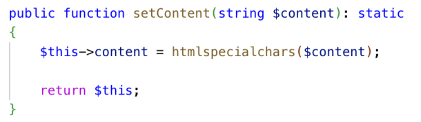

# Crypto Market

This is a student project to learn about security with symfony. I have take the subject of cryptocurrency and use an api to get data from CoinMarketCap see https://coinmarketcap.com/api/.

## Prerequisites

- PHP >= 8.1
- Composer 2.5
- Symfony CLI
- MySQL database

The CoinMarketCap api key is a free plan, it has a limit of 10 000 requests per mounth, you can use this api key but if it reach the limit you can create your own api key for free on https://coinmarketcap.com/api/
The api key should be add in the .env.local file to secure it, here it is a student project and an free plan api so i put it in the .env to let user test the app without any configuration.

## Installation

1. Run this command to clone the repository:
   git clone https://github.com/Romain-Parisot/CryptoMarketSymfonyProjectCRUD.git

2. Run this command to navigate to the project directory:
   cd SYMFONYTD_01_03_2024

3. Run this command to install dependencies:
   composer install

4. Set up the environment variables in by creating an `.env.local`, copy this command line into this file and edit it with your personal data
   DATABASE_URL="mysql://UserOfYourLocalConfigForDatabaseConnection:PasswordOfYourLocalConfigForDatabaseConnectionIf YouHaveOne@127.0.0.1:3306/NameOfTheDatabase?serverVersion=8.0.32&charset=utf8mb4"

5. Run this command to create the database:
   `php bin/console doctrine:database:create`

## Database Setup

1. If you look at src/DataFixtures/MarketFixtures i have created initial data to add into the database, you can run this command to load these initial data:
   `php bin/console doctrine:fixtures:load `

## Running the Project

1. Start the Symfony development server:
   `symfony serve`

2. Access the application in your web browser at `http://localhost:8000`.

3. Create a user at this URL http://localhost:8000/register :

4. Login with your credential at http://localhost:8000/login:

5. You can create an Admin user by adding this command to src/controller/UserProfileController.php line 23

`$user->setRoles(['ROLE_ADMIN']);`

Warning, don't forget to remove this line once tou have created a admin user or all of the next user creating an account will be admin.

# Maintain the code for developers

This project cover the main security issue know at current date of 01/03/2024, it will cover :

- SQL Injection
- XSS Attack
- CSRF Attack
- DDOS Attack

As a reminder this will just check for basic known attack and this project is not 100% secure as all of the project on the web.

## SQL

When making requests, developers should use prepared statements to prevent SQL injection attacks. This ensures that the application is more secure and less vulnerable to attacks. In Symfony, Doctrine ORM automatically uses prepared statements when persisting or removing entities.

## DDOS

This kind of attack should be manage by the hoster, you need to apply a limit of request to prevent database crash.

## XSS

When setting data, developers should escape HTML to prevent cross-site scripting (XSS) attacks. This is crucial for maintaining the security of the application and protecting user data, otherwise attacker could implement malicious script in forms.
One of the methos i have used in this project to prevent this kind od attack is to use htmlspecialchars() function on the set function of all the field that in forms:



You can found an example on line 54 to 59 of src/entity/market.php

## CSRF

Developers should also implement CSRF tokens to protect against cross-site request forgery attacks, by ensuring that requests made to the application are genuinely from the user and not from a malicious third party. This CSRF token should be use on all the CRUD route if it is not a from.
For example, in the project, i have added a CSRF token to delete method into market CRUD and create/delete method on favorite CRUD.
Here is an example on src/controller/MarketController:

```php
    #[Route('/market/delete/{id}', name: 'app_market_delete')]
    public function delete(EntityManagerInterface $entityManager, Request $r, Market $market)
    {
        if ($this->isCsrfTokenValid('delete' . $market->getId(), $r->request->get('csrf'))) {
            $entityManager->remove($market);
            $entityManager->flush();
        }
        return $this->redirectToRoute('app_market');
    }
```

and you need to provide this token from the Front-end like this:

```php
  
    <td class="market_data_crypto_field" >
      <form action="{{ path('app_market_delete', {'id': crypto.id}) }}" method="post">
        <input type="hidden" name="csrf" value="{{ csrf_token('delete' ~ crypto.id) }}">
        <input type="submit" value="Delete" class="delete_button">
      </form>
    </td>
  
```

## Access right

As you can see above you need to use  to check if the user connected have the access role to access to this element, with this implementation elment in thse tags will not be rendered at all if he don't have the good access right.

You can also block some route is the user don't have the right access permission, see an example here :

```yaml
access_control:
  - { path: ^/user, roles: ROLE_USER }
  - { path: ^/user/*, roles: ROLE_USER }
  - { path: ^/market, roles: PUBLIC_ACCESS }
```

With this command all the user can access to market data but only connected user can access to user pages.

## Storage

When you store data in thedatabase, you need to hash all passwords. Hashing password secure the data because that will store into database some data that cant be hash back to a normal string. We also need to encrypt sensitive data to don't allow attacker to simply read data on the database. Encrypt data is less secure than hash beacause encrypting can be reverted, and hash can't, but sometime you need to display some data to the user so you need to revert the encrypting, if you don't need to revert it you must need to use hashing instead of encrypting to be more secure.

## Slug

You better need to use Slug instead of directly use the id in the url to limit the information tou give to potential attackers.
